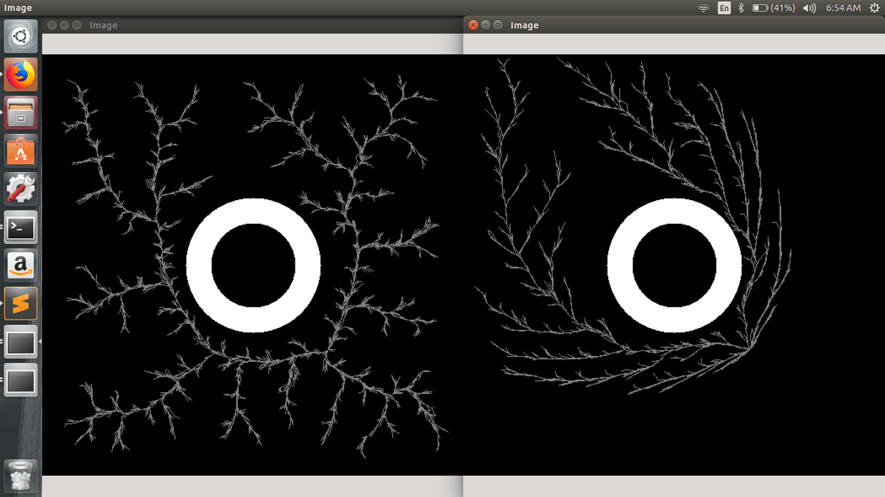
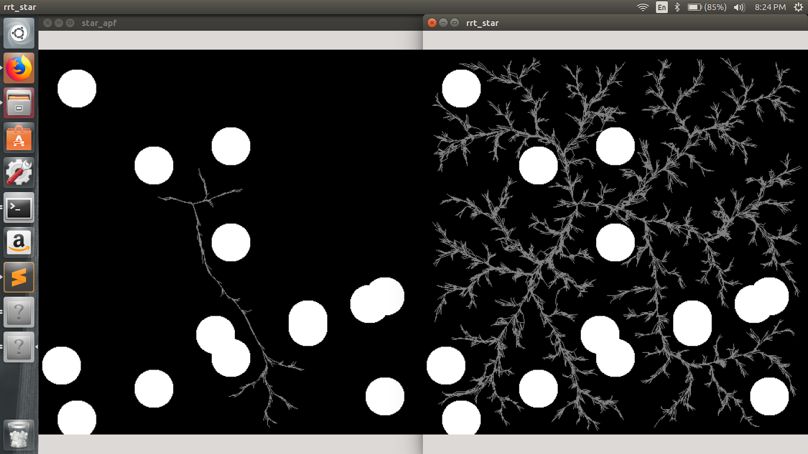
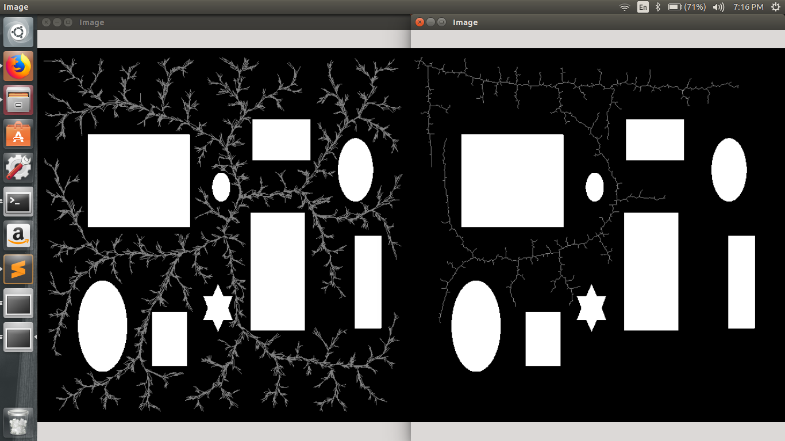

This Repository contains my implementation of RRT-Star and RRT-Star with artificial Potential Field.

The algorithms have been implemented in Opencv C++.

Instructions to Run the codes:
1. Install Opencv
2. Download the Makefile and the C++ codes and place them in the same folder
3. Make, build and run the codes. Enter the source and destination co-ordinates and you are done.

